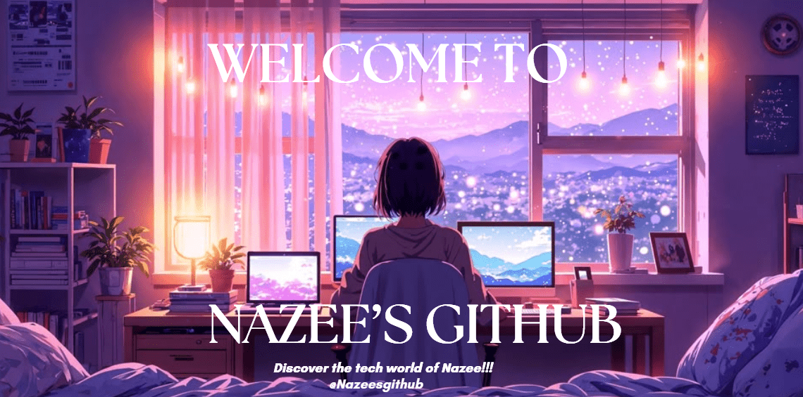

# 💫 About Me:</h1>

 💡  I like to explore new technologies and develop software solutions and quick hacks. 🎓  I’m currently studying Computer Science with AI   at NIBM ,Sri Lanka. 🌱  I’m on track for learning more about Artificial Intelligence,Front end and Backend development. ✍️  In my free time, I pursue Creating new recipies and playing chess as hobbies.. 💬  Feel free to reach out to me for pro bono consulting and volunteering, or just for some interesting discussion. ✉️  You can shoot me an email at nazeeyamaani@gmail.com I’ll try to respond as soon as I can. 

## 🌐 Socials: </h2>
<a href="https://www.linkedin.com/in/aditya-deshmukh-561a371a8"> 
      

# 💻 Tech Stack:
               

<strong>Front-End Development</strong>:

# 📊 GitHub Stats:
 
 

## 🏆 GitHub Trophies

### 🔝 Top Contributed Repo

### ✍️ Random Dev Quote

